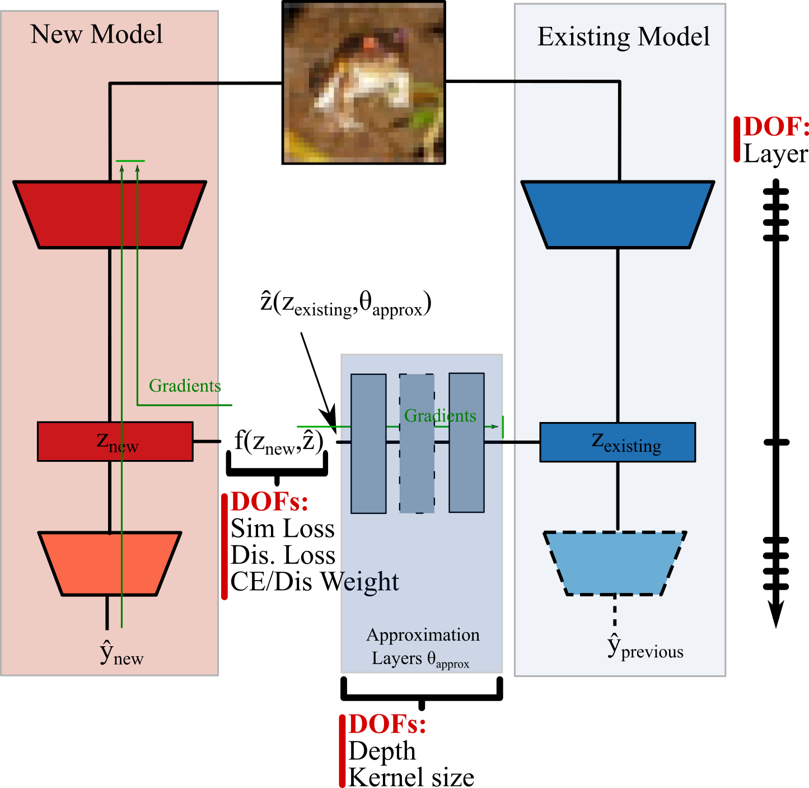

## Representation Transfer

This repo contains the codebase that was used to train models conditioned on pre-existing other models.
It is focused on training a model conditioned on one/many pre-existing models that are supposed to change
behavior of the new model.

To accomplish this there exist various ways of training models that can be broadly
split into three categories:

- Adapting the input
- Regularizing at the output (logits/predictions)
- Regularizing in intermediate position of architecture ("hidden layers")
-----
### Intermediate regularization
As this repo is focused on regularization at the very input some schemes are experimented with
that are supposed to make the models more dissimilar at some intermediate layer.
By doing so one enforces that the layer exhibits low levels of e.g. Correlation at some intermediate layer,
which does not necessarily mean it stands in conflict with the task performance as it might be at the very output.

> Previous related work that tried to work on logits/probabilities had issues!
> E.g. trying to learn low correlation in logits lead to bad performance
> and hence is not really feasible or helpful.

-----------

The following approaches are investigated:

#### Knowledge Extension

Knowledge Extension is the original idea that regularizes representations at some intermediate layer
by creating an adversarial setting of an old model that tries to approximate the newly learned representations of the
new model, while the new model tries to circumvent this.

The **intermediate losses** that are used to enforce this are generally bounded in order to be invertible,
to allow the new model to **minimize similarity** and to allow the old models to **maximize similarity**.
Losses like L1/L2 Correlations therefore are appealing as well as some Explained Variance losses that can be
wrapped in a CELU to bound it.

The old model(s) remains frozen and the approximation is can only improve through training
of the **approximation layers** that are some **CONV-BN-RELU** layers with either 1x1 or 3x3 kernel size and
varying number. These hyperparameters allow to break some translation constraints and increase the
"distance" that the representations have to have from each other in representation space.

This leads to a rather involved and finnicky process as huge variety of DOFs need to be
explored.
